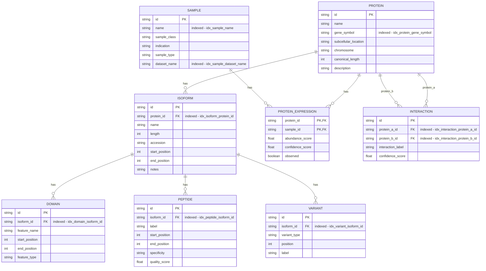
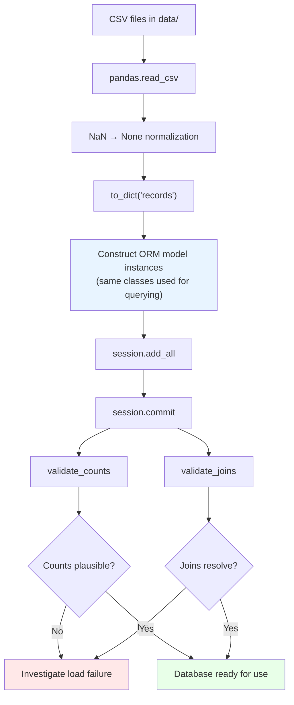
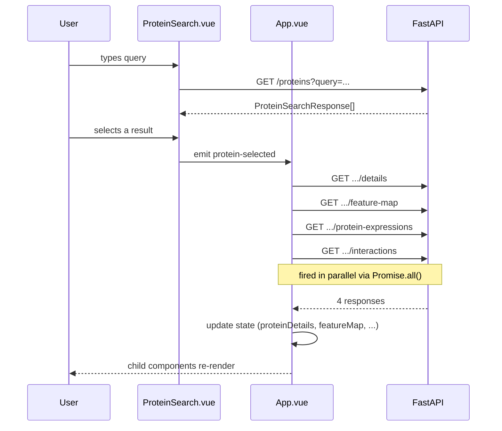
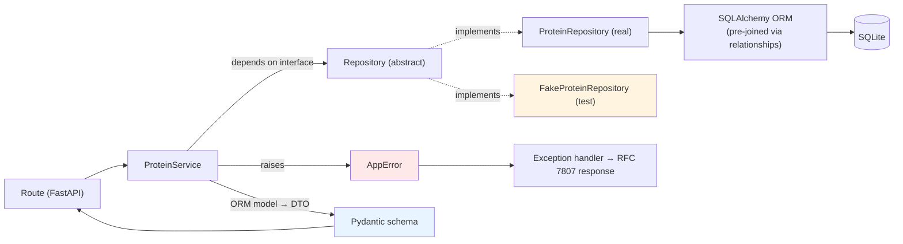
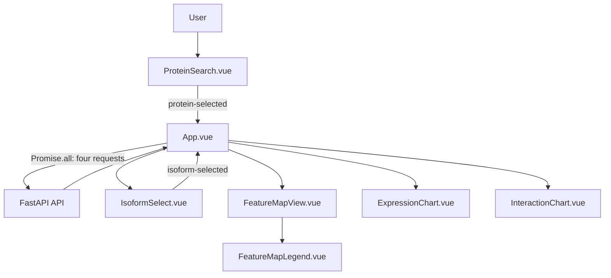

# Protein Explorer

This application is a protein data explorer: a FastAPI backend serves protein, isoform, expression, and interaction data from a SQLite database, and a Vue.js frontend lets a user search for a protein and visualize it across three views.


## Setup

### Prerequisites

- Python 3.11+
- Node 18+
- npm (bundled with Node)

### Backend setup

From the repository root:

```bash
python -m venv .venv
source .venv/bin/activate      # Windows: .venv\Scripts\activate
pip install -r requirements.txt
```

Copy `backend/.env.example` to `backend/.env`:

```bash
cp backend/.env.example backend/.env
```

It sets:

```
HOST=0.0.0.0
PORT=8000
CORS_ORIGIN=http://localhost:5173
```

`CORS_ORIGIN` tells the backend which frontend origin to allow — it defaults to `http://localhost:5173` if unset, which matches the frontend dev server's default port, so this only needs changing if you run the frontend on a different port. `HOST`/`PORT` control where the backend itself listens, and are read by `backend/run.py` (see [Running the project](#running-the-project) below).

### Frontend setup

```bash
cd frontend
npm install
cp .env.example .env
```

The frontend `.env` sets:

```
PORT=5173
VITE_API_BASE_URL=http://localhost:8000
```

`PORT` controls the Vite dev server's port (read in `vite.config.ts`, not exposed to client code). `VITE_API_BASE_URL` is the backend base URL used by `proteinClient.ts` — adjust either if you change the backend's host/port above.

---

## Running the project

Run these in order from a fresh checkout, each in its own terminal:

1. **Initialise/load the database:**
   ```bash
   python backend/database/create_database.py
   ```
   This drops and recreates `proteins.db`, then loads all seed data from the CSVs in `data/`. You should see row counts and a few join spot-checks printed at the end confirming the load succeeded.

2. **Start the backend API** (from the repository root, with the virtual environment active):
   ```bash
   python backend/run.py
   ```
   The API serves on the `HOST`/`PORT` set in `backend/.env` (`http://localhost:8000` by default). You can sanity-check it directly with `curl "http://localhost:8000/proteins?query=kinase"`.

3. **Start the frontend:**
   ```bash
   cd frontend
   npm run dev
   ```
   Runs on the `PORT` set in `frontend/.env` (`5173` by default).

4. **Open the app:** `http://localhost:<frontend PORT>` — `http://localhost:5173` with the defaults above.

> **Note:** step 1 only needs to be re-run if you want to reset the database or the seed data changes — it's not required on every restart. Steps 2 and 3 need to be running simultaneously for the app to work, since the frontend calls the backend over HTTP.

---

## Overview

This application is a protein data explorer: a FastAPI backend serves protein, isoform, expression, and interaction data from a SQLite database, and a Vue.js frontend lets a user search for a protein and visualize it across three views.

**Typical user journey:**
1. The user searches for a protein by name or gene symbol in the search bar.
2. Selecting a result triggers four parallel API calls (protein details, feature map, expression data, interactions).
3. Once loaded, the app renders:
   - A **feature map** — an SVG view of the selected isoform's domains, peptides, and variants positioned along its sequence, with an isoform picker if the protein has more than one.
   - An **expression chart** — abundance scores across samples, grouped by sample class (e.g. Cancer/Normal/Cell line).
   - An **interaction panel** — other proteins this one is known to interact with, along with confidence scores.


## Database Design: Protein Expression & Interaction Schema


This schema follows a normalized relational design: each entity captures a single, well-defined concept, and relationships between entities are expressed through foreign keys.

See [Create table statements](/backend/database/schema.sql) for full SQL schema.



### Central Entities: Protein and Isoform

**Protein** and **Isoform** sit at the heart of the schema, and nearly every other table hangs off one of them directly or indirectly.

This two-tier hub structure (`Protein` → `Isoform` → structural annotations) keeps the schema normalized: sequence-level facts live on `Isoform`, and protein-level facts live on `Protein`, with no redundant copying of chromosome, gene symbol, or subcellular location down into the child tables.

### Index Strategy

Indexes in this schema are deliberately applied in two places: **foreign keys** and **identifier/lookup fields** — not applied to every column.

**Foreign key indexes** exist on every FK column used in a JOIN:
- `idx_isoform_protein_id`, `idx_domain_isoform_id`, `idx_peptide_isoform_id`, `idx_variant_isoform_id`
- `idx_interaction_protein_a_id`, `idx_interaction_protein_b_id`

Because `Protein` and `Isoform` are the central hubs, queries very commonly walk *down* the hierarchy (e.g. "all domains for this isoform" or "all isoforms for this protein"). Without an index on the FK side, each of these lookups would force a full table scan on the child table. Indexing the FK columns keeps these traversals — which are the most common access pattern in a hub-and-spoke schema like this — cheap regardless of table size.

**Identifier/lookup indexes** exist on columns used to *find* a row from outside the graph, rather than to join within it:
- `idx_protein_gene_symbol` — proteins are frequently looked up by gene symbol rather than by internal ID (e.g. from an external gene panel or search box)
- `idx_sample_name` and `idx_sample_dataset_name` — samples are searched both individually and by dataset, so both access patterns get their own index


## Summary

The schema's normalization keeps facts in exactly one place, its hub structure around `Protein` and `Isoform` mirrors the natural biological hierarchy (protein → isoform → structural detail), and its indexing strategy is targeted rather than exhaustive — covering the FK columns that support hierarchical traversal and the identifier columns that support external lookup, without over-indexing columns that are rarely queried directly.

## Data loading approach

**Pandas for ingestion.** Each entity's source data lives in a flat CSV (`proteins.csv`, `isoforms.csv`, etc.), and pandas is used purely as a lightweight ETL step — read the CSV, normalize `NaN` to `None` so SQLAlchemy receives proper nulls instead of stray floats, then convert to a list of dicts for bulk construction. Given the dataset size here, this is the right level of tooling: the CSVs fit comfortably in memory, and pandas' parser is more forgiving of type coercion and missing-value handling than a raw `csv.DictReader` would be. There's no need for a heavier ingestion framework or chunked/streaming reads at this scale.
 
**Same ORM models for writing and reading.** The model classes defined in `models.py` (`Protein`, `Isoform`, `Domain`, and so on) are the single source of truth for the schema. They're used to construct rows during loading, and the *same* classes are used later for querying — walking relationships like `isoform.domains` or `expression.sample.name`. Because there's only one model definition, the write path and read path can never drift apart: a column rename or new constraint only has to happen in one place, and relationship wiring (`back_populates`) is correct and available immediately after load with no separate read-model to keep in sync.
 
**Validation checks.** Two passes currently run after load:
- *Row counts* — confirms each table has a plausible number of rows, catching gross failures like a CSV not loading or a table ending up unexpectedly empty.
- *Join spot-checks* — walks one join path per relationship type (isoform → domains/peptides/variants, protein_expression → sample, interaction → both proteins) to confirm relationships resolve correctly.



## API Design

Endpoints are UI-driven rather than generic CRUD: each one returns the exact shape a specific frontend component needs, pre-joined and pre-nested, so `App.vue` never has to reshape data client-side after fetching it.

### `GET /proteins`

**Query params:** `query` (search string, max 100 chars), `limit` (default 10, max 100)
**Response:** `List[ProteinSearchResponse]` — flat list of `protein_id`, `protein_name`, `gene_symbol`, `description`

A flat, minimal shape is enough here because this endpoint only backs a search dropdown — the caller needs just enough to display and pick a result, not the full protein record.

**Used in:** `ProteinSearch.vue`, via debounced calls as the user types. On selection it emits `protein-selected`, which `App.vue` catches in `onProteinSelected()` to kick off the four detail fetches below.

---

### `GET /proteins/{protein_id}/details`

**Response:** `ProteinDetails` — `protein_id`, `protein_name`, `gene_symbol`, `description`, `subcellular_location`

**Used in:** `App.vue`, stored in `proteinDetails`. Feeds the panel headers for both the expression chart (`"Protein Expression - {{ proteinDetails.protein_name }}"`) and the interaction chart, and is passed as a prop into `InteractionChart.vue` so it can label the queried protein without a second lookup.

---

### `GET /proteins/{protein_id}/feature-map`

**Response:** `FeatureMap` — `protein_id` + `isoforms: List[IsoformMap]`, where each isoform nests its own `domains`, `peptides`, and `variants`

This is the clearest example of the UI-driven principle: `FeatureMapView.vue` needs to draw all three annotation types positioned against a single isoform's sequence, so the response pre-joins isoform → domains/peptides/variants server-side. Without this nesting, the frontend would need three separate calls plus client-side grouping by `isoform_id` before it could render anything.

**Used in:** `App.vue`, stored in `featureMap`. Also drives `IsoformSelect.vue` (the isoform picker is built from `featureMap.isoforms`), and `selectedIsoform` (a computed property) picks out the isoform currently shown in `FeatureMapView.vue`.

---

### `GET /proteins/{protein_id}/protein-expressions`

**Response:** `List[ProteinExpressionSample]` — each entry has `protein_id`, a nested `sample_detail` (`sample_id`, `sample_name`, `sample_class`), `abundance_score`, `observed`

`sample_class` is nested inside `sample_detail` rather than flattened, because `ExpressionChart.vue` groups bars by `sample_class` — keeping sample metadata as a sub-object mirrors how the chart actually consumes it (one grouping key, one set of sample identifiers) and keeps the shape self-documenting.

**Used in:** `App.vue`, stored in `proteinExpressions` and passed directly as a prop to `ExpressionChart.vue`.

---

### `GET /proteins/{protein_id}/interactions`

**Response:** `List[ProteinInteractionDetails]` — `interaction_id`, a nested `interactor_protein: ProteinDetails`, `interaction_label`, `confidence_score`

The interacting partner is returned as a full nested `ProteinDetails` object rather than just an ID, so `InteractionChart.vue` can render partner names and gene symbols directly without an extra round-trip per interaction.

**Used in:** `App.vue`, stored in `proteinInteractions` and passed as a prop to `InteractionChart.vue` alongside `proteinDetails`, so the chart can distinguish the queried protein from its interactors.

---

### Fetch pattern

All four detail endpoints (`details`, `feature-map`, `protein-expressions`, `interactions`) are called together via `Promise.all()` in `onProteinSelected()` once a protein is picked from search — they're independent of each other, so firing them in parallel avoids waterfalling four sequential round trips into one.



## Backend Design
 
The backend follows a strict layered flow — **route → service → repository → ORM → database** — where each layer only talks to the one directly below it. `ProteinService` never imports SQLAlchemy or touches a session directly; it depends only on the `Repository` interface, and routes never construct Pydantic responses themselves. This separation is what makes the error handling, mocking, and testing approach below possible.
 
### Consistent error handling with `AppError`
 
Every "not found" case across all four protein-scoped endpoints raises the same `AppError(status_code, title, detail)` — for example, an unknown `protein_id` in `get_feature_map`, `get_protein_expressions`, `get_protein_interactions`, or `get_protein_details` all raise a 404 in exactly the same shape, rather than each service method inventing its own error format. A single exception handler at the app level (not shown here, but referenced from `main.py`) catches `AppError` and serializes it into a Problem Details (RFC 7807) response, while any *unexpected* exception is caught separately, logged server-side, and returned as a generic 500 — so internal errors are never accidentally leaked to the client. The service layer only ever needs to know about one exception type, which keeps error handling declarative: raise `AppError` and stop, rather than threading try/except through every branch.
 
### Repository pattern
 
`ProteinService` depends on an abstract `Repository`, not a concrete database implementation — it calls methods like `search_proteins()`, `get_isoforms_with_features()`, `get_protein_expressions_with_samples()`, and `get_protein_interactions()` without knowing whether they hit SQLite, a mock, or (in future) a different database entirely. This shields the service from direct database communication: SQL, sessions, and ORM queries live entirely behind the repository boundary, and the service only ever deals in ORM model objects returned from it.
 
### Mocking for testability
 
Because the service takes its repository via constructor injection (`__init__(self, protein_repository: Repository)`), tests can swap in a `FakeProteinRepository` that returns hardcoded model instances instead of hitting a database — no test database, no fixtures beyond plain Python objects. This is what makes fast, isolated unit tests possible: each endpoint's business logic (aggregation, error cases, DTO shaping) is exercised without any I/O. The natural structure this suggests is one test class per service method/endpoint, each built around a `MockRepository` fixture returning the specific model shapes that method needs — isoforms with nested domains/peptides/variants for the feature map, expressions with a `.sample` relationship populated for expressions, and so on — plus a not-found case per method to confirm `AppError` is raised correctly.
 
### Model → DTO translation
 
Every service method follows the same pattern: fetch ORM model(s) from the repository, then explicitly construct a Pydantic response object field-by-field (e.g. `ProteinSearchResponse(protein_id=protein_model.id, ...)`). This translation step is deliberate rather than incidental — it means the API's response shape is never accidentally coupled to the database schema. A column could be renamed or a table restructured, and only the translation in the service layer needs to change; the Pydantic schema (and therefore the frontend contract) stays stable. It also means internal-only fields on the ORM models are never accidentally serialized just because they exist on the object.
 
### SQLAlchemy ORM for pre-joined queries
 
The repository layer leans on the ORM's predefined relationships (`back_populates`) rather than hand-written SQL joins, so a call like `get_isoforms_with_features(protein_id)` can return isoform models with `.domains`, `.peptides`, and `.variants` already populated, and `get_protein_expressions_with_samples(protein_id)` can return expression models with `.sample` already populated. This is what lets the service build nested response shapes like `FeatureMap` and `ProteinExpressionSample.sample_detail` without issuing extra queries per isoform or per expression — the relationship structure defined once in `models.py` is reused directly by every read path that needs it.
 

## Frontend visualisation approach

The frontend is built with **Vue 3**. Vue was chosen because JavaScript was new to me, and its component model provided a clear way to break the interface into small, understandable pieces while learning the language. `App.vue` acts as the parent coordinator: it owns the selected protein and the loaded API data, while child components receive the data they need through props and communicate user selections back through emitted events.

The visualisation is split into a component per section of the interface:

- `ProteinSearch.vue` provides debounced protein search and emits the selected protein ID.
- `IsoformSelect.vue` displays the available isoforms and emits the selected isoform ID.
- `FeatureMapView.vue` renders the selected isoform's domains, peptides, and variants.
- `ExpressionChart.vue` renders protein abundance across samples.
- `InteractionChart.vue` renders the selected protein and its interaction partners.
- `FeatureMapLegend.vue` explains the feature-map colours.

When a protein is selected, `App.vue` calls the four protein detail endpoints in parallel with `Promise.all()`. It stores the returned feature map, expression data, interaction data, and protein details, then passes each result to the relevant child component. This keeps data fetching and application state in one place, while each visualisation remains responsible for its own rendering logic.



### Feature map: SVG

The feature map uses native **SVG**. Amino-acid positions map directly to the SVG coordinate system: the isoform's sequence length is used as the `viewBox` width, and each domain or peptide is drawn with an `x` position and `width` calculated from its start and end positions. Variants are represented as vertical lines at their amino-acid positions. This makes the biological coordinates explicit and allows the whole map to scale responsively while preserving the relative positions of its features. SVG titles also provide a simple hover description for individual features.

SVG is also used for the interaction view, where the selected protein is placed at the centre and interacting proteins are positioned around it. The line width and opacity encode interaction confidence.

### Expression chart: Plotly

The expression chart uses **Plotly** because it provides useful interactivity out of the box, including responsive rendering and hover tooltips. It creates grouped bar traces for the three sample classes (`Cancer`, `Normal`, and `Cell line`):

- Each bar represents one sample.
- The bar height is the sample's `abundance_score`.
- Bars are coloured according to the sample class.
- The opacity indicates whether the measurement was observed.
- Hover text shows the sample, abundance score, class, and observed status.

This gives the chart enough interaction for exploring individual measurements without requiring a separate custom tooltip or charting interaction layer.

## AI usage

AI tools were used as a development aid rather than as a replacement for design or review. At the start of the project, I used AI to create initial notes from the requirements and identify the main design areas to consider, including the database structure, API boundaries, frontend visualisations, and testing approach. These notes helped me focus the initial design before implementation.

During implementation, I used targeted AI assistance for specific components, particularly on the frontend. This included help with Vue component structure, prop and event flows, SVG positioning, Plotly chart configuration, and TypeScript types. I also used AI to help write up the documentation and explain design decisions clearly, including the reasoning behind the repository pattern, UI-driven API responses, and the choice of SVG and Plotly.

The resulting code and documentation were manually reviewed and adapted to fit the project. I checked that the suggested component boundaries matched the actual user journey, that API responses matched the Pydantic schemas and frontend types, and that the visualisation behaviour reflected the underlying biological data. AI-generated suggestions were therefore treated as starting points that required verification, rather than copied without review.

## Trade-offs and future improvements

The current implementation prioritises a clear, demonstrable architecture over a fully featured production interface. The main trade-offs and possible improvements are:

- **Basic UI interactions** — the interface currently offers limited interaction beyond feature-map hover text and Plotly's built-in chart interactions. It could be extended with zooming and panning for long isoforms, richer filtering, clickable features, and more detailed tooltips.
- **Single-isoform view** — only one isoform is displayed at a time. Overlaying multiple isoforms would make comparison easier, although it would require careful handling of different lengths, feature density, and visual clutter.
- **Choice of frontend framework** — Vue was a good fit for learning JavaScript and for keeping the interface component-based. React could be considered for a larger application if I had stronger React experience or wanted access to a wider ecosystem of specialised visualisation components, but changing frameworks would not by itself solve the current interaction limitations.
- **Repository pattern and database validation** — the repository abstraction makes service tests fast and isolated by allowing a fake repository to be injected. It is less useful for validating the correctness of the database load itself, because those tests bypass the real database and ORM relationships. A separate integration test suite should exercise the real SQLite database, repository queries, and relationship loading together.
- **Shallow database validation** — the loader currently checks row counts and spot-checks joins, but checking only the first row can miss problems elsewhere. Stronger validation would include full-table or sampled referential-integrity checks, duplicate and uniqueness checks, and reconciliation between source CSV row counts and loaded table counts. SQLite foreign-key enforcement should also be enabled explicitly where appropriate.
- **Testing scope** — the project includes service-level unit tests with a fake repository, but no integration tests covering the API against a real database and no frontend component or end-to-end tests. Adding these would catch mismatches between ORM models, Pydantic responses, frontend types, and rendered behaviour.
- **Error and loading states** — the frontend currently loads the four detail datasets together with `Promise.all()` and logs a failure if the request fails. Visible loading, empty, partial-failure, and retry states would make the application more robust for real users. Independent requests could also be handled separately if one visualisation should remain available when another request fails.
- **UI-driven API coupling** — endpoint responses are shaped closely around the current components, which keeps the frontend simple and avoids client-side reshaping. The trade-off is that changing a component's data needs can require changing the API contract as well. Versioned or more reusable response schemas may be preferable as the application grows.
- **Hard-coded visualisation categories** — the expression chart currently knows the supported sample classes in advance (`Cancer`, `Normal`, and `Cell line`). Deriving categories and colours from configuration or the API would make the chart easier to reuse with other datasets.
